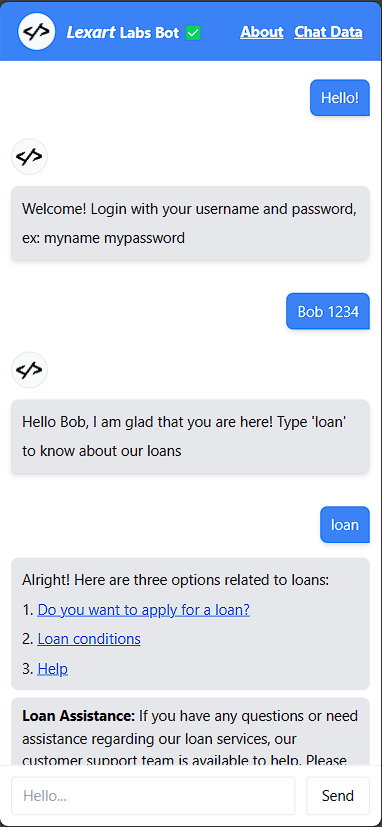
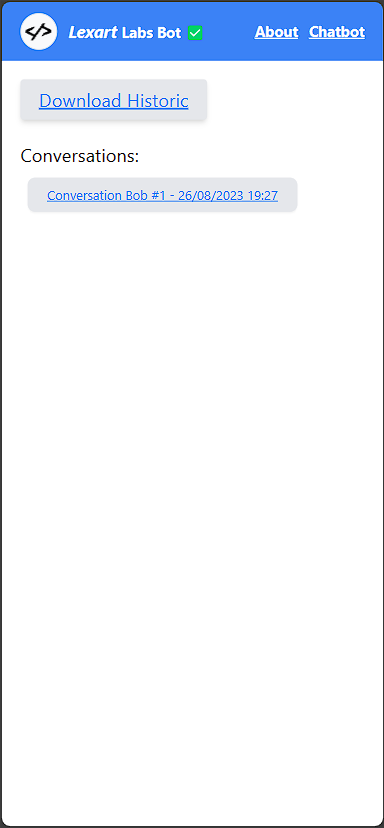
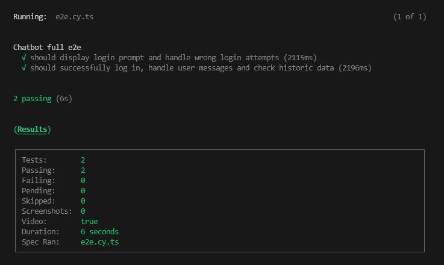
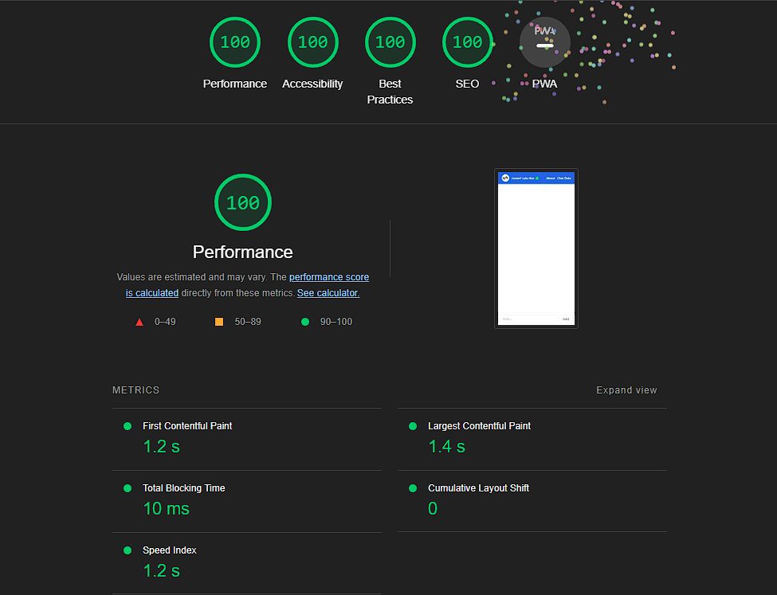

# Project: Lexart Full Stack Developer Challenge

Welcome to the readme for the Lexart Full Stack Developer Challenge project. This project involves the creation of a web chatbot with various features and technologies. Below, you will find an overview of the project's features and the technologies used.

## How to Run
PS: You can experience the live version hosted on [Vercel](https://lexart-challenge-frontend-git-main-henriksantos.vercel.app/).

To get started, follow these steps:
1. **Install dependencies**:
Open a terminal and run the following command:

```bash
npm install
```

2. **Build the Project**:
Before you can preview the project, you need to build it. Open your terminal and navigate to the project directory. Then, execute the following command:

```bash
npm run build
```

3. **Preview the Project**:
Once the project is built, you can preview it using the following command:

```bash
npm run preview
```

4. **Open in Browser**:
After running the preview command, open your web browser and go to the following URL:
[http://localhost:4173/](http://localhost:4173/)

## How to Run Tests

1. **Run the project in developer mode**:
Open a terminal and run the following command:

```bash
npm run dev
```

2. **Run tests**:
Open a new terminal and run `"npm test"` or `"npm run test:open"`. The command `"npm run test:open"` will open a window; you will need to select "e2e", choose a browser to run the tests on and finally select the "e2e.cy.ts" test.

## About

### Project Features

1. **Intelligent Conversation Initiation**: The chatbot initiates conversations based on keywords such as "Hello," "Goodbye," "Good," and "I want."

2. **User Authentication**: Users are required to provide a username and password.

3. **Contextual Options**: Upon encountering the term "loan," contextual options are displayed. These options include:
    - Application for a loan
    - Loan conditions
    - Help

4. **Relevant Information Display**: The chatbot displays relevant information and reference links based on user selections.

5. **Conversation Conclusion and Storage**: Conversations can be concluded using the term "Goodbye." The chat data is stored in a database.

6. **Export Historic Conversations**: Users can export historic conversations in CSV format, ordered by date, accessible on the "Chat Data" page.

### Technologies Used

- [React](https://react.dev/): A JavaScript library for building user interfaces.
- [TypeScript](https://www.typescriptlang.org/): A typed superset of JavaScript that compiles to plain JavaScript.
- [Tailwind CSS](https://tailwindcss.com/): A utility-first CSS framework for building responsive and stylish designs.
- [React Router](https://reactrouter.com/en/main): A library for adding routing functionality to React applications.
- [Cypress](https://www.cypress.io/): An end-to-end testing framework for web applications.
- [ESLint](https://eslint.org/): A tool for identifying and fixing code quality issues in JavaScript.

## Project Images




## Results

### Tests



https://github.com/HenrikSantos/lexart-challenge-frontend/assets/36730816/e24a3eee-0732-4012-a092-36c969f727b4

### Lighthouse



## Contact

If you have any questions or feedback, feel free to reach out to the project's author at [henrik.ruan4@gmail.com](mailto:henrik.ruan4@gmail.com).
